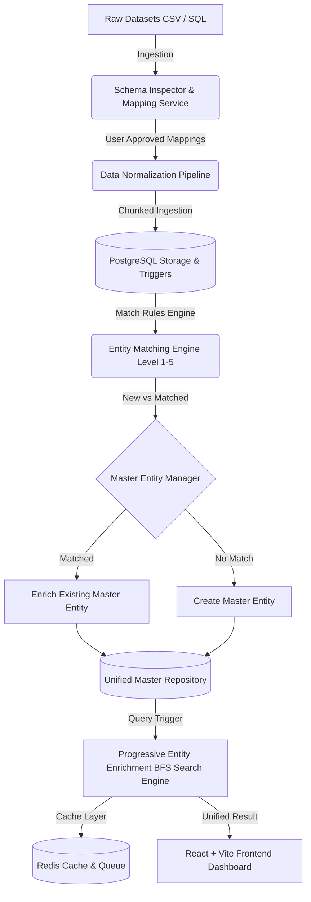

# Multi-Database Entity Resolution & Unified Data Repository — System Architecture

## 1. System Overview

The **Multi-Database Entity Resolution Platform** is a web-based, enterprise-grade data unification system designed to ingest heterogeneous CSV datasets and database dumps, perform schema inspection, auto-suggest field mappings, clean and normalize raw data, batch-match records belonging to real-world entities, and build a unified master repository powered by **Progressive Entity Enrichment**.



---

## 2. Frontend Architecture (React + Vite)

- **Framework**: React 18 with Vite for ultra-fast bundling and HMR.
- **Styling**: Modern CSS with dark-mode glassmorphism aesthetics, custom CSS variables, responsive grid systems, micro-animations, and dynamic status badges.
- **State & API**: Axios instance connected to FastAPI REST API with real-time health heartbeats and auto-refreshing stats.
- **Components Structure**:
  - `StatisticsManager`: Executive KPI analytics dashboard, dataset contribution breakdowns, and match-rate metrics.
  - `SourcesManager`: File drag-and-drop uploader, dataset registry, and interactive schema column inspection modal.
  - `FieldMappingManager`: Rule & AI-based field mapping proposals with confidence scores, sample preview, and manual override.
  - `ImportProcessingManager`: Multi-stage batch processing execution control with live progress stepper.
  - `UnifiedSearchManager`: Intelligent search box with sample query chips, progressive enrichment path visualizer, and master entity result cards.
  - `EntitiesRepositoryManager`: Searchable table repository of all resolved master entities.
  - `EntityDetailModal`: 5-tab deep inspection modal covering Overview, 1-to-N Source Traceability, Attribute Conflicts, Relationship Network Graph, and Enrichment Audit Trail.

---

## 3. Backend Architecture (FastAPI + SQLAlchemy)

- **Framework**: Python FastAPI (ASGI) for high-performance async request processing and automatic Swagger documentation.
- **ORM & DB**: SQLAlchemy with PostgreSQL backend (SQLite for isolated unit/integration test suite).
- **Core Modules**:
  - `app/api/sources.py`: Source upload, metadata registration, and chunked CSV header inspection.
  - `app/api/mappings.py`: Canonical field mapping proposal generator and approval persistence.
  - `app/api/imports.py`: Synchronous and chunked batch ingestion pipeline runner.
  - `app/api/search.py`: Progressive Entity Enrichment search endpoint.
  - `app/api/statistics.py`: Aggregated platform statistics and source breakdown metrics.
  - `app/api/entities.py`: Master entity repository listing, conflict detector, and graph constructor.
  - `app/api/jobs.py`: Asynchronous background processing job monitor.

---

## 4. Database Schema Design (PostgreSQL)

- `sources`: Tracks source metadata (`id`, `source_name`, `source_type`, `file_name`, `file_path`, `status`).
- `import_batches`: Ingestion batch audit log (`id`, `source_id`, `status`, `processed_records`, `matched_records`, `new_entities`, `error_count`).
- `source_mappings`: Field column mapping rules (`id`, `source_id`, `raw_column_name`, `canonical_field`, `confidence`, `is_approved`, `mapping_type`).
- `source_records`: Raw un-mutated input data stored alongside normalized attributes (`id`, `source_id`, `batch_id`, `row_identifier`, `raw_data`, `normalized_data`).
- `master_entities`: Consolidated entity profile (`id`, `canonical_profile`, `status`, `created_at`, `updated_at`).
- `entity_attributes`: 1-to-N granular field attributes per entity with primary flags and raw value links (`id`, `entity_id`, `source_record_id`, `attribute_name`, `raw_value`, `normalized_value`, `is_primary`).
- `entity_identifiers`: High-cardinality search index table (`id`, `entity_id`, `identifier_type`, `normalized_value`, `source_record_id`).
- `entity_source_links`: Complete 1-to-N source-level traceability junction (`id`, `entity_id`, `source_id`, `batch_id`, `source_record_id`, `match_type`, `confidence`, `linked_at`).

---

## 5. Core Engine: Progressive Entity Enrichment

The progressive enrichment algorithm uses a **Breadth-First Search (BFS) Queue** to discover implicit relationships across decoupled datasets without requiring pre-joined tables.

### Algorithm Flow:

1. **Input Query**: User enters an identifier (e.g. `john@gmail.com`).
2. **Normalizer**: Normalize input into canonical format.
3. **Queue Initialization**: `identifier_queue = [normalized_input]`, `visited_set = {}`.
4. **BFS Loop**:
   - Dequeue `curr_identifier`.
   - Mark `curr_identifier` as visited.
   - Query `entity_identifiers` for `normalized_value == curr_identifier`.
   - For each matching Master Entity:
     - Query all other `entity_identifiers` associated with that entity (e.g., phone `9876543210`, username `johndoe`, member_id `M-1024`).
     - For any unvisited identifier, enqueue it.
     - Record discovery step into the `enrichment_chain` visual log.
5. **Termination**: Loop completes when no new unvisited identifiers are discovered.
6. **Result Assembly**: Return consolidated Master Entity profile along with complete 1-to-N source record traceability.

---

## 6. Normalization & Matching Engines

### Normalization Pipeline (`NormalizationService`):
- **Email**: Lowercase, strip whitespace (`" JOHN@GMAIL.COM "` → `john@gmail.com`).
- **Phone**: Remove non-numeric characters except leading plus, standardizing international format (`"+91 98765-43210"` → `9876543210`).
- **Text / Names**: Strip outer whitespace, collapse multiple spaces, title-case (`"  John    Doe "` → `"John Doe"`).
- **Null values**: Map `""`, `"NULL"`, `"N/A"`, `"null"`, `"none"` to `None`.

### Matching Rules Hierarchy (`MatchingService`):
- **Level 1**: Exact Normalized Email match (`confidence: 1.0`).
- **Level 2**: Exact Normalized Phone match (`confidence: 1.0`).
- **Level 3**: Exact Normalized Username match (`confidence: 0.95`).
- **Level 4**: Exact Normalized Member ID match (`confidence: 0.95`).
- **Level 5**: Composite Fuzzy Match (Name + City/Phone, `confidence: 0.85`).

---

## 7. Scalability & Large File Processing

- **Chunked CSV Reading**: Large files (>100,000 rows) are processed in 10,000-row chunks using Pandas / Python CSV streams to maintain low RAM usage (<200MB).
- **Indexing**: Database indexes on `entity_identifiers.normalized_value`, `entity_attributes.entity_id`, and `entity_source_links.entity_id` ensure O(1) query lookups.
- **Incremental Import**: Adding a new dataset matches against existing master entities and enriches them without re-processing historical datasets.

---

## 8. Deployment & Docker Architecture

The application is containerized using Docker & Docker Compose:

```bash
docker-compose up --build -d
```

Services:
1. `frontend`: React SPA served via Nginx (Port 3000 -> 80).
2. `backend`: FastAPI app running uvicorn worker processes (Port 8000).
3. `postgres`: PostgreSQL 15 database container (Port 5432).
4. `redis`: Redis 7 cache & background job queue (Port 6379).

---

## 9. Verification & Testing

Run backend test suite:
```bash
cd backend
.\venv\Scripts\python.exe -m pytest
```

All 12 unit and integration tests verify:
- Source upload & metadata parsing.
- Field mapping proposal generation & approval.
- Normalization routines.
- Progressive Entity Enrichment BFS chain.
- System statistics aggregation.
- Entity repository listing & 404 error handling.
